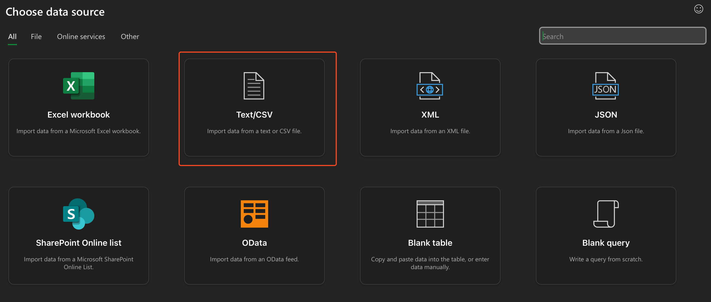

# **BikeStores Data Analysis Project**
**A sample Data Analysis project utilizing theoretical sales data from a bike shop. Technical stack involves PostgreSQL, MS Excel, and Tableau.**

_Created by Kristoffer Buenaventura_


- [**BikeStores Data Analysis Project**](#bikestores-data-analysis-project)
  - [Disclaimer](#disclaimer)
  - [Understanding the Principles of Data Analysis](#understanding-the-principles-of-data-analysis)
  - [Applying Data Analysis Principles to Sample Project](#applying-data-analysis-principles-to-sample-project)
  - [PostgreSQL Database Setup](#postgresql-database-setup)
  - [Generating Dataset \& Loading Dataset into Excel](#generating-dataset--loading-dataset-into-excel)
  - [Excel Analysis \& Visualization](#excel-analysis--visualization)
  - [Connecting Excel to Tableau](#connecting-excel-to-tableau)
  - [Tableau Data Visualization](#tableau-data-visualization)
  - [Key Differences \& Issues](#key-differences--issues)

<br>

## Disclaimer

The initial inspiration for the BikeStores data analysis project was created by _**Work the Data**_ Youtube channel and can be found [here](https://www.youtube.com/watch?v=1pHYKdyRvrw).

A few key strategic decisions were made to change the technical stack used in Work the Data's tutorial. These decisions were based on my personal technical stack & desired practice objectives.

A summary of these differences can be found in the [Key Differences & Issues](#key-differences--issues) section later on in this document.

## Understanding the Principles of Data Analysis

The [core five components of any Data Analysis](https://hightouch.com/blog/steps-for-data-analysis) project involve:

1. _**Understand the problem.**_
   - Identify stakeholders and business requirements.
   - Define clear, measurable goals & objectives.
2. _**Collect and gather the data.**_
   - Identify data sources (database, API, flat-file, etc.)
   - Extract the data using data extraction tools.
3. _**Clean the data.**_
   - Handle any missing values or inconsistencies.
   - Normalize & transform the data.
4. _**Gather & analyze the data.**_
   - Test hypotheses using exploratory data tools.
   - Use a data visualization tool to identify patterns and insights.
5. _**Interpret the results.**_
   - Summarize key findings & insights.
   - Create a dashboard to present findings.
   - Create sound documentation on entire analysis methods used.

## Applying Data Analysis Principles to Sample Project

## PostgreSQL Database Setup

## Generating Dataset & Loading Dataset into Excel

In order to generate an effective dataset that will provide insights to all the clients' questions, we must query from the related tables that we had previously loaded.

This will require several `JOINs` among the related tables. The final SQL query can be found in the [`dql_gen_dataset.sql`](../sql/dql/dql_gen_dataset.sql) file.

This query also introduces two new aggregation columns, `TOTAL_UNITS_SOLD` and `REVENUE`. The calculations for those columns can be found below:

```SQL
    ...
	sum(ite.quantity) as total_units_sold,
	sum(ite.quantity * ite.list_price) as revenue
```

These aggregation columns will assist in providing additional insight in our future data analysis.

<br>

_**Loading Dataset into Excel**_

After the primary dataset is generated in the PostgreSQL database, it can be saved locally via CSV file. The generated dataset can be found within the `data` folder as [`bikestores_dataset.csv`](../data/bikestores_dataset.csv).

Within Microsoft Excel, under the `Data` tab, click the `Get Data` button. From there, use the `Text/CSV` to select the generated dataset, and load it into Excel.



Once complete, we are now ready to analysis the generated dataset within Excel (and later on, Tableau).

## Excel Analysis & Visualization

_**To follow along with the Excel analysis, refer to [bikestores_analysis.xlsm](../data/bikestores_analysis.xlsm)

<br>

Within our Excel analysis of the dataset, we seek to generate our clients at the Bike Store the following insights:

1. Total Revenue per year 
2. Total Revenue per month over the entire time period given

In order to produce these insights, we will utilize **pivot tables** within Excel to generate a dashboard.

## Connecting Excel to Tableau

## Tableau Data Visualization

## Key Differences & Issues

As stated in the **Disclaimer** introduction, there were a few key differences in the technology stack used within this personal project as opposed to the _**Work the Data**_ tutorial. These differences posed an interesting amount of technical & strategical challenges that had to be overcome.

A summary below:

1. _**Use of PostgreSQL vs. MS SQL Server**_

_**PostgreSQL**_ was used as the primary DBMS rather than _**MS SQL Server**_. This change necesitated a variety of syntax-related updates, such as:

```SQL
-- DDL for creating project tables

-- SQL Server syntax
CREATE TABLE production.categories (
	category_id INT IDENTITY (1, 1) PRIMARY KEY,
	category_name VARCHAR (255) NOT NULL
);

-- PostgreSQL syntax
CREATE TABLE production.categories (
	category_id INT GENERATED BY DEFAULT AS IDENTITY (START WITH 1 INCREMENT BY 1) PRIMARY KEY,
	category_name VARCHAR (255) NOT NULL
);
```
<br>

2. _**Use of Microsoft Office 2021 for Mac vs. MS Office Windows**_

The _**Work the Data**_ tutorial was performed on a Windows-device, while this project was created using a MacOS-based device. This led to several complications, particularly in the usage of _**Excel for Mac 2021**_ in the Excel analysis component of the project.

For example, during the Excel analysis, it was required to decouple multiple PivotTables using the same data source so that different grouping methods could be applied to each PivotTable in isolation. While this would easily be performed in Windows using the **PivotTable Wizard** functionality, no such feature on Excel MacOS existed. Therefore, a workaround for the problem was found using Excel VBA, and I was able to use a macro to essentially manually decouple the PivotTables from the data sources.

The macro used can be found [here](../scripts/vba_sep_PvtTable.txt).

For more information on this particular issue, please see the [Excel Unplugged](https://excelunplugged.com/2013/06/05/how-do-i-separate-pivottables/) article here.

Overall, these decisions to change the technical stack created interesting and beneficial challenges in ensuring that the end product remained the same despite the differences in technologies used.